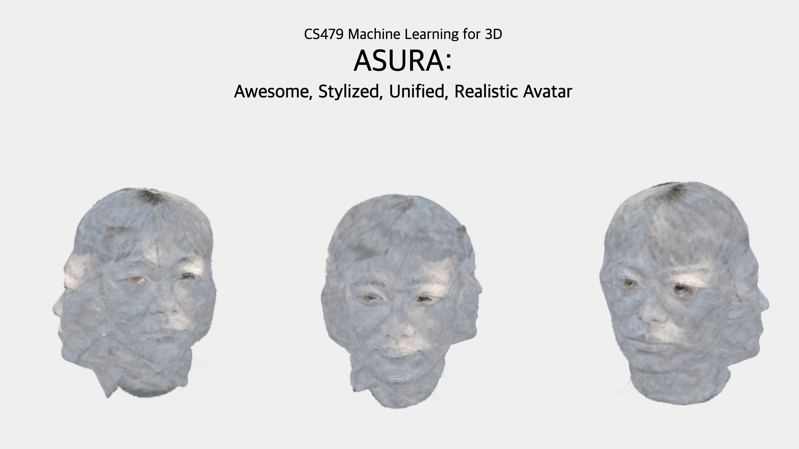

# CS479 Final Project "ASURA" Rendering page



## How to start server

1. Set Python version 3.X
2. Download the project output "combined.ply" from ([Download link](https://drive.google.com/drive/folders/1yh09-bKQhnmLCKCq4KMMCvBD3eKyCQdB?usp=drive_link)) (file is in `ply/`)
3. Clone the repository and move to cs479-proj-web/

```
   git clone --recurse-submodules https://github.com/sys7498/cs479-proj-web.git
   cd cs479-proj-web
```

4. Move the "combined.ply" to "splats/" directory
5. Start server

```
python -m http.server 8000 --bind 127.0.0.1
```

6. Open "[http://127.0.0.1:8000/Gaussian-Splatting-WebViewers gaussian_splatting_2_three.js/](http://127.0.0.1:8000/Gaussian-Splatting-WebViewers/gaussian_splatting_2_three.js/)"
